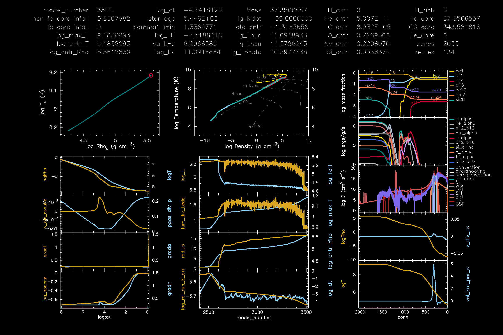

# Workflow: Building a Rotating Massive Star Model to Core Collapse with MESA

This workflow describes how to evolve a rotating massive star model using MESA, from the main sequence to core collapse, defined here as the point when parts of the iron core reach inward velocities of at least **–500 km/s**.

## Overview

The evolution is split into two stages:

1. **Up to the end of carbon burning**
2. **From oxygen burning to core collapse**

Each stage uses a separate MESA work folder and inlist configuration. No mass loss in stage 2, which is fine as this is just ~20 years of stellar evolution.

---

## 1. Evolve to End of Carbon Burning

**Folder**: `m50_w0.6_z1d-5/`
**Purpose**: Evolve the rotating massive star model from ZAMS to the end of carbon burning.

* Start with the standard template used by Jake for the Population III stars project.
* This step will output a saved model at the end of carbon burning:

```bash
cburning.mod
```

---

## 2. Evolve to Core Collapse

**Folder**: `m50_w0.6_z1d-5_to_cc/`
**Purpose**: Resume evolution from the end of carbon burning to core collapse.

* Begin by loading the `cburning.mod` model from step 1.
* Use the custom wrapper command:

```bash
./run_to_cc
```

* The evolution will continue until the core reaches collapse conditions.
* Final model is saved as:

```bash
CC.mod
```

### Notes on Configuration

* The inlist for this phase is based on the setup developed with Mathieu Renzo, Jared Goldberg, Eb Farag and others for Ore Gottlieb's project.
* Two key settings that helped stabilize the outer layers (which are prone to late-time instabilities) are:

  * `superad_reduction` (superadiabaticity reduction)
  * `Pextra_factor = 4`

These adjustments help suppress oscillations in the envelope during advanced burning stages.

---

## Output

* Final model:
  `m50_w0.6_z1d-5_to_cc/CC.mod`

* Profile at collapse (inward velocities ≥ 500 km/s):
  `m50_w0.6_z1d-5_to_cc/LOGS/profile21.data`


  

